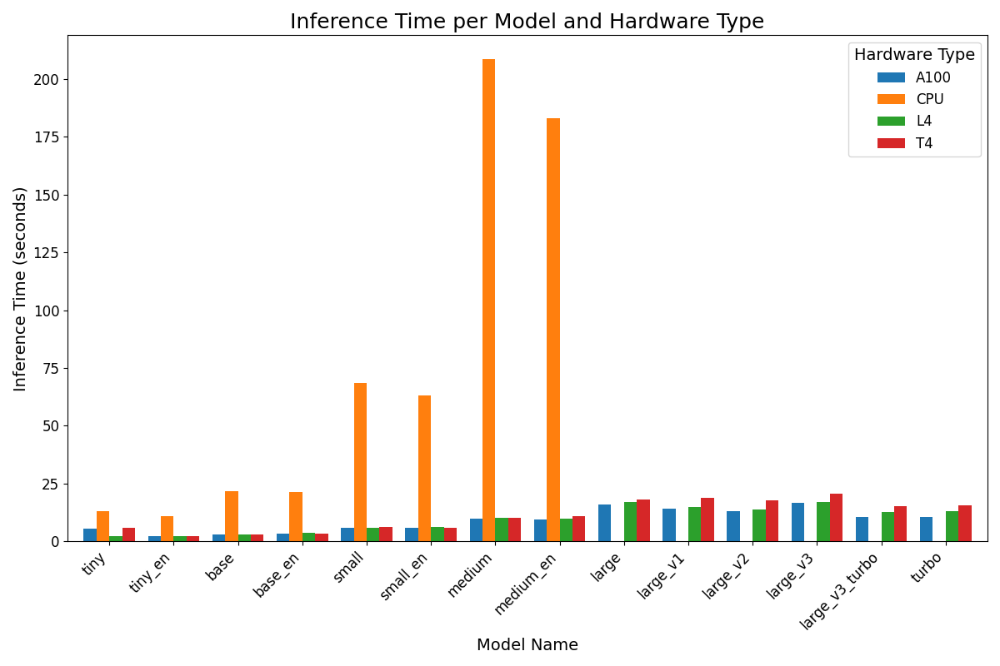
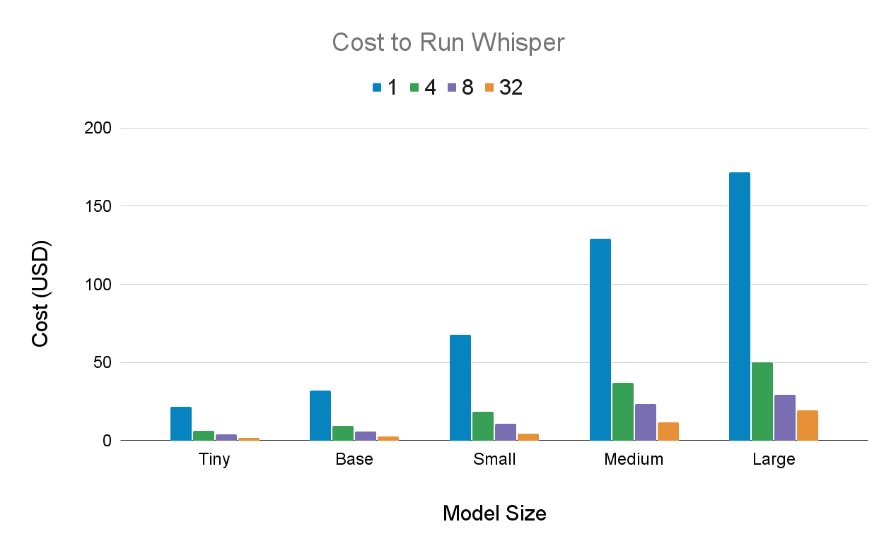

# Free Whisper API with GPU backend

This repository demonstrates how to create a free whisper API with a GPU backend, so you can get transcripts more quickly. Here's a comparison of inference times on the different hardware options in Colab ([source](https://www.assemblyai.com/blog/free-whisper-api-gpu/)):



While not a robust/permanent solution, it can save you money on small projects. Here's the cost to transcribe 1000 hours of audio with Whisper on an A100 in GCP for different model and batch sizes ([source](https://www.assemblyai.com/blog/how-to-run-openais-whisper-speech-recognition-model/)):



You can try also [transcribe files in just a few minutes with Python](https://www.assemblyai.com/blog/assemblyai-and-python-in-5-minutes/) if you're looking for a no-setup solution using AssemblyAI. Grab a free API key to start transcribing, understanding, and prompting your audio files.

<picture>
    <source media="(min-width: 720px)" srcset="key.svg">
    
</picture>

# Initial setup

1. Create an [Ngrok account](https://dashboard.ngrok.com/signup) if you do not already have one and verify your email
2. Make sure Python 3.9 or 3.10 is installed on your system

# Start the API

## To run with GPU

Go to the companion Colab:

<a href="https://colab.research.google.com/drive/1Lzp_VZ2QEqfqEzs2ZdYJb35A_ivIqVwt?usp=sharing">
  
</a>

Follow the instruction to start the API

## To run locally

You can also run the API locally. While this method doesn't offload the inference to Colab, you may want to do this while using the `tiny` model for testing, or with the `large` model if you have a GPU.

### Local setup

1. Open a terminal and set your ngrok authtoken with `ngrok authtoken YOUR-AUTHTOKEN-HERE`. You can find your authtoken on your [dashboard](https://dashboard.ngrok.com/get-started/your-authtoken)
2. Install [ffmpeg](https://www.ffmpeg.org/) if it is not already installed on your system
3. (Optional) Create a virtual environment for your project with `python3 -m venv venv` and then activate it with `. venv/bin/activate` on Linux/MacOS or `.\venv\Scripts\activate.bat` on Windows. You may have to use `python` instead of `python3`
4. Install the required packages with `pip install -r requirements.txt`

### Start the API

1. Run `python3 api.py` in order to start the Flask API at `http://127.0.0.1:8008`

# Consume the API

Once your API is up and running, you can hit it using any tool that can make POST requests. For example, you can use `cURL` to make requests in the terminal. Be sure to replace the URl with your Ngrok URL (or localhost if running locally) with the `/transcribe` endpoint

```bash
curl -X POST "https://YOUR-URL.ngrok-free.app/transcribe" \
-H "Content-Type: application/json" \
-d '{"file": "https://storage.googleapis.com/aai-web-samples/Custom-Home-Builder.mp3", "model": "tiny"}'
```

You can also consume your API in Python with the `requests` library:

```python
import requests
import os

NGROK_URL = "https://YOUR-URL.ngrok-free.app/"
TRANSCRIBE_ENDPOINT = os.path.join(NGROK_URL, "transcribe")

json_data = {'file': "https://storage.googleapis.com/aai-web-samples/Custom-Home-Builder.mp3",
            'model': 'tiny'}
response = requests.post(TRANSCRIBE_ENDPOINT, json=json_data)

print(response.json()['transcript'])
```

You can check out/execute `basic-request.py` to see how to make requests to the API for both remote and local files.

You can take a look at `transcribe.py` to see a more robust way of calling the API that abstracts away the calling details.
